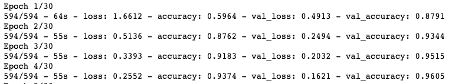
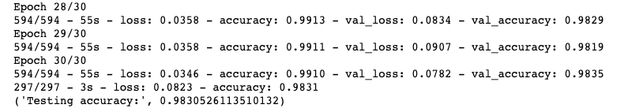
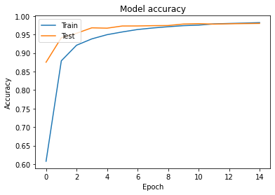
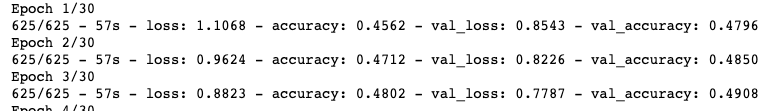
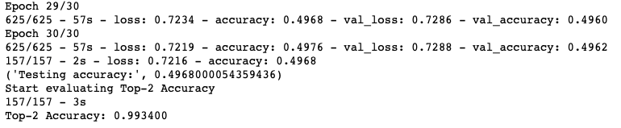
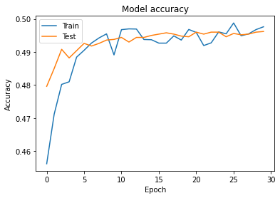
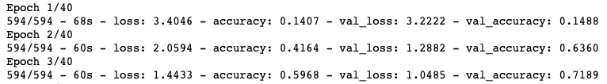
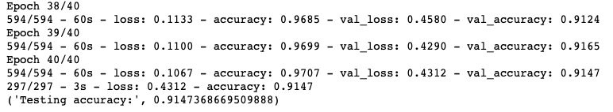
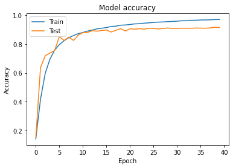

# re-fi

GitHub address: https://github.com/fool321/re-fi/

**Undermining Website Fingerprinting Defenses with Deep Learning**

This project is for a final assignment, intended for reasearch purposes only. The source code is wrote as .ipynb, and we run the code in Colab.

## Introduction

In this project, we use deep learning to undermine website fingerprinting with cnn & resnet model.

### dataset

We use the given dataset, which is similar to the dataset in the reference,  as well as the dataset structure & dataset format.

### Reproduce Results

download and run the notebook, you **may** need to adjust some file path and import the data according to the path in the notebook or just change the path in the code.

## Attack Accuracy

#### Non-Defended Evaluation

#### Walkie-Talkie Evaluation (also include top-2 prediction)

#### WTF-PAD Evaluation

## Questions and comments

Feel free to address any questions or comments to us.

## Reference

https://github.com/deep-fingerprinting/df